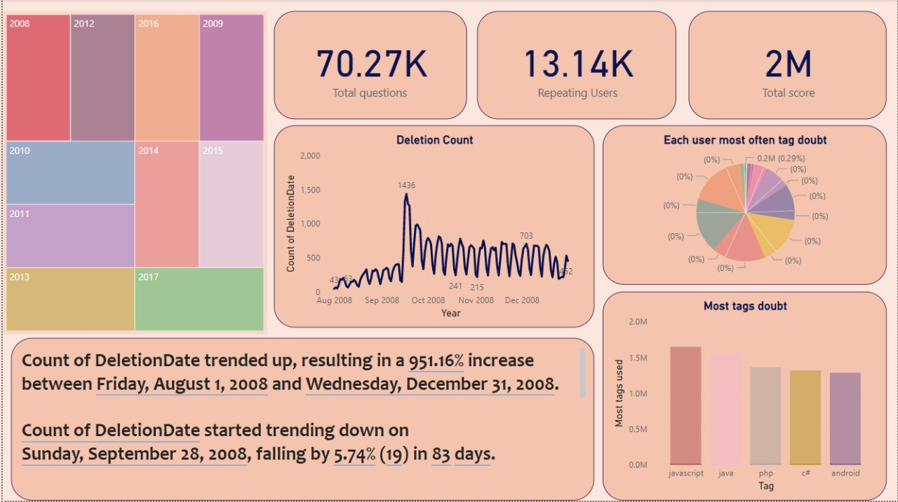

# stackoverflow-data
<h2>Datasets link <h3><u>https://www.kaggle.com/datasets/stackoverflow/stacklite?datasetId=259&language=Python</u></h3></h2>

<h2>Purpose of the project:-</h2>
<b><i>
<ul>
<li>Database model by selecting appropriate schema, in this case i choose star schema over snowflake schema!!</li>
<li>Big data analysis with dataset rows more than 5 millions.</li>
<li>Dashboard using Power BI</li>
</i></b>

<h2>Dashboard</h2>

<h2>Used components:-</h2>
<b><i>
<ul>
<li>TreeMap</li>
<li>Cards</li>
<li>Stacked Bar chart</li>
<li>Line Chart</li>
<li>Insight text</li>
<li>Pie Chart</li>
</ul>
</i></b>
